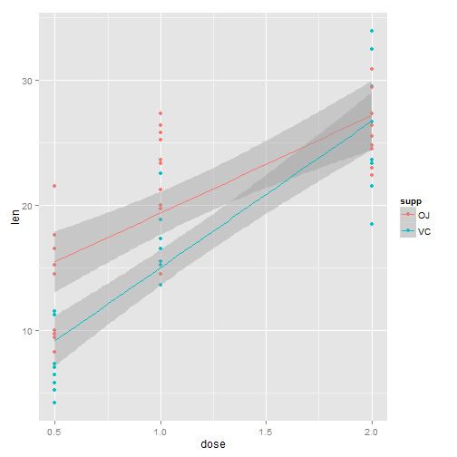
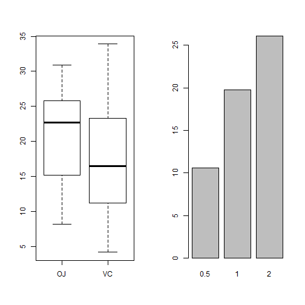

**Peer Assignment2 for Statistical Inference** 
---  
author: winnie 
date: Sunday, October 25, 2015

Overview  
---  
analyze the ToothGrowth data in the R datasets package  

1. Load the ToothGrowth data and perform some basic exploratory data analyses  
---  

```r
library(datasets)
data(ToothGrowth)
str(ToothGrowth)
```

```
## 'data.frame':	60 obs. of  3 variables:
##  $ len : num  4.2 11.5 7.3 5.8 6.4 10 11.2 11.2 5.2 7 ...
##  $ supp: Factor w/ 2 levels "OJ","VC": 2 2 2 2 2 2 2 2 2 2 ...
##  $ dose: num  0.5 0.5 0.5 0.5 0.5 0.5 0.5 0.5 0.5 0.5 ...
```

```r
library(ggplot2)
qplot(dose,len,data=ToothGrowth,color=supp,geom=c("point","smooth"),method="lm")
```

 

- from the plot we can see that the dose has 3 levels: 0.5,1,2  
- with each level of dose there are several length growth of teeth   
- as the dose increase, the length increase  
- It seeems that OJ is more useful than VC in helping the teeth to grow.
- When the supplement was given in lower dose, it seems that the difference betwween efficiency of OJ and VC was more obvious than in higher dose.  


2. Provide a basic summary of the data.  
---  

```r
par(mfrow=c(1,2))
boxplot(len~supp,data=ToothGrowth)
data0 <- transform(ToothGrowth,dose=factor(dose))
data1<-tapply(data0$len,data0$dose,mean)
barplot(data1)
```

 
- From the boxplot we can see that the length of VC group are more widerly spread than the OJ group which means the efficiency of VC might less steadly than OJ.  
- From the barplot we can see validate that the dose has an positive effect on the growth of the teeth.  

3. Use confidence intervals and/or hypothesis tests to compare tooth growth by supp and dose.  
---  
- split the len into two groups with the facror supp  
- calculate the confidence intervals of the average of 2 groups and compare them  
- compare the t test result of two groups which indicates that whether the average of these groups are statiscally different.  

```r
group_VC <- split(data0$len,data0$supp)$VC
group_OJ <- split(data0$len,data0$supp)$OJ
ttestVC <- t.test(group_VC)
ttestOJ <- t.test(group_OJ)
print(ttestVC)
```

```
## 
## 	One Sample t-test
## 
## data:  group_VC
## t = 11.24, df = 29, p-value = 4.363e-12
## alternative hypothesis: true mean is not equal to 0
## 95 percent confidence interval:
##  13.87675 20.04992
## sample estimates:
## mean of x 
##  16.96333
```

```r
print(ttestOJ)
```

```
## 
## 	One Sample t-test
## 
## data:  group_OJ
## t = 17.134, df = 29, p-value < 2.2e-16
## alternative hypothesis: true mean is not equal to 0
## 95 percent confidence interval:
##  18.19678 23.12989
## sample estimates:
## mean of x 
##  20.66333
```
- From the t test result we can see that the 95% conficence interval of the group used VC as supplement is [13.87675,20.04992] while the group used OJ is [18.19678,23.12989]  
- The means of 2 groups are different too, VC group is19.9633  and OJ group is 20.66333.  
- Now we make a pair t test to find out if the VC mean is larger than the OJ mean statiscally.  

```r
pairtest <- t.test(group_VC,group_OJ,paired=TRUE)
pairtest2 <- t.test(group_VC,group_OJ)
print(pairtest)
```

```
## 
## 	Paired t-test
## 
## data:  group_VC and group_OJ
## t = -3.3026, df = 29, p-value = 0.00255
## alternative hypothesis: true difference in means is not equal to 0
## 95 percent confidence interval:
##  -5.991341 -1.408659
## sample estimates:
## mean of the differences 
##                    -3.7
```

```r
print(pairtest2)
```

```
## 
## 	Welch Two Sample t-test
## 
## data:  group_VC and group_OJ
## t = -1.9153, df = 55.309, p-value = 0.06063
## alternative hypothesis: true difference in means is not equal to 0
## 95 percent confidence interval:
##  -7.5710156  0.1710156
## sample estimates:
## mean of x mean of y 
##  16.96333  20.66333
```
- if the same group of people took VC and OJ in different times to make the records in the experiment, the situation suits for pairtest whose p-value=0.00255 which means the mean in two groups are different.  
- if different groups of people took VC and OJ in different times to make the records in the experiment, the situation suits for pairtest2 whose p-value=0.06063 which means no evidence indicates that the mean in two groups are different at 95% confidence.  

Conclusion  
---  
The effect of OJ supplement are better for growing teeth than VC supplement.
