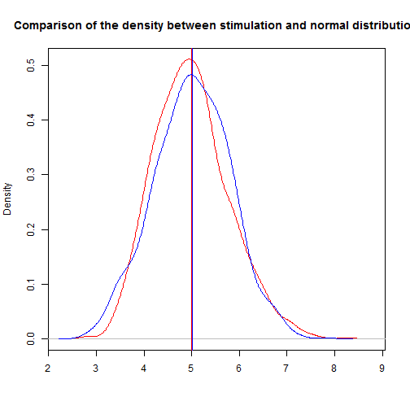

#Statistical Inference-Peer Assignment
author: "winnie"
date: "Sunday, October 25, 2015"

Overview   
---
Compare the distribution of normal distribution and the sample mean of exponential distribution,they are near because of Central Limit Theorem.  
So if the exponential distribution has mean of $mu$ and standard deviation of $sigma$ then its sample mean $M$ will obey the nomal distribution of $M~N(mu,sigma^2/n)$  

0. Stimulation of an exponential distribution  
---
- set the seed so the result will be reproducible  
- create a random sequential of exponential distribution with lamda=0.2  
- take the sample mean of 1000 stimulations and the sample mean will be stored in mexp  


```r
set.seed(6666)
exp0 <- rexp(10000,rate=0.2)
mexp <- numeric(1000)
for(i in 1:1000){
  mexp[i] <- mean(sample(exp0,40,replace=TRUE))
}
```

1. Show the sample mean and compare it to the theoretical mean of the distribution.  
---
- the sample mean should obey normal distribution so the theoretical mean should be equal to 1/lamda which is 1/0.2=5

```r
print(mean(mexp))
```

```
## [1] 4.994655
```
it is close~  

2. Show how variable the sample is (via variance) and compare it to the theoretical variance of the distribution.  
---
- as mentioned, the theoretical variance should be (1/(lamda^2))/40=(1/(0.2^2))/40=25/40=0.625


```r
print(var(mexp),digits=4)
```

```
## [1] 0.6254
```

3. Show that the distribution is approximately normal.  
---  
- create a random normal sequential of 1000 large and the relevent mean and sd  
- create their density for plotting  
- the **red one** is sample mean distribution and the **blue one** is the normal distribution, we can see that their distribution are similiar to each other

```r
d <- (density(mexp))
set.seed(8888)
sd_z <- (1/0.2)/(40^0.5)
z <- rnorm(1000,mean=5,sd=sd_z)
dz <- density(z)

par(new=FALSE)
plot(d,col="red",main="Comparison of the density between stimulation and normal distribution",xlab="")
abline(v=mean(mexp),col="red")
lines(dz,col="blue")
abline(v=mean(z),col="blue")
```

 

```r
dev.copy(png,"distribution.png")
```

```
## png 
##   3
```
